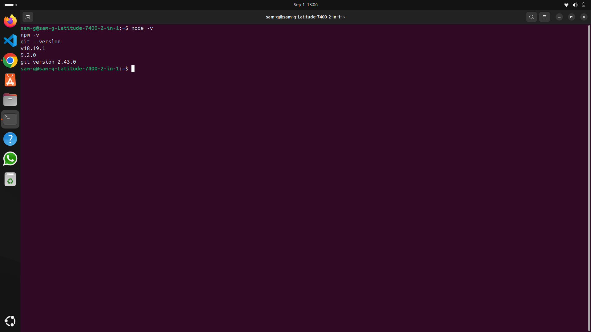

# internship-task-1
# Internship Task 1 - Environment Setup

This repository documents the setup of my full-stack development environment for my internship.

---

## ✅ Installed Tools

- **Node.js**: v18.19.1  
- **npm**: v9.2.0  
- **Git**: v2.43.0  
- **Database**: (to be installed – MongoDB or PostgreSQL)  
- **Code Editor**: VS Code with extensions:
  - Prettier
  - GitLens
  - Thunder Client (for API testing)

---

## 🖥️ Basic Terminal Commands Practiced

- **Navigation**  
  - `pwd` → show current directory  
  - `ls` → list files and folders  
  - `cd <folder>` → change directory  

- **File & Folder Management**  
  - `mkdir <folder>` → create new folder  
  - `touch <file>` → create new file  
  - `rm <file>` → remove a file  

- **Git Commands**  
  - `git init` → initialize repository  
  - `git add .` → stage changes  
  - `git commit -m "message"` → commit changes  
  - `git branch -M main` → rename branch to main  
  - `git remote add origin <url>` → connect to GitHub repo  
  - `git push -u origin main` → push to GitHub  

---

## 🔗 GitHub Repository

👉 [https://github.com/samuel-m765/internship-task-1](https://github.com/samuel-m765/internship-task-1)

---

## 📌 Next Steps

- Install a database (MongoDB or PostgreSQL) and confirm version.  
- Add screenshots of installed tools (Node.js, npm, Git, VS Code, Database).  
- Create a simple Express.js project as part of Task 2.  

---
## 🖼️ Proof of Work

All proof screenshots for Internship Task 1 are stored in the `proof/` folder.

- **Setup Proof**  
  
